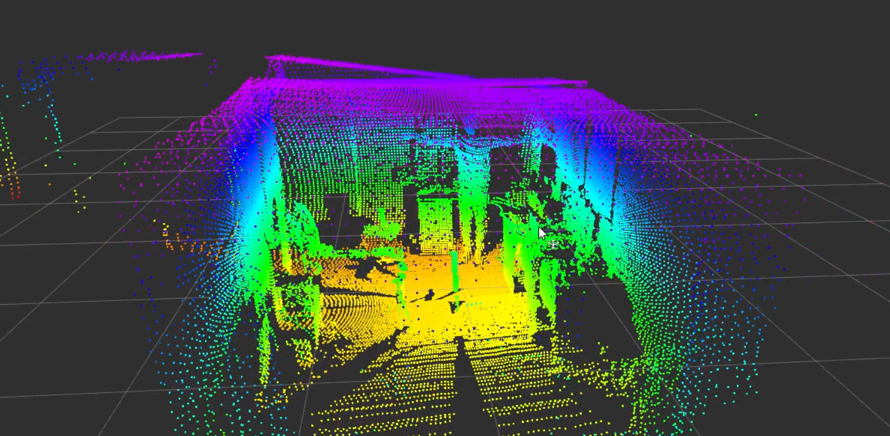
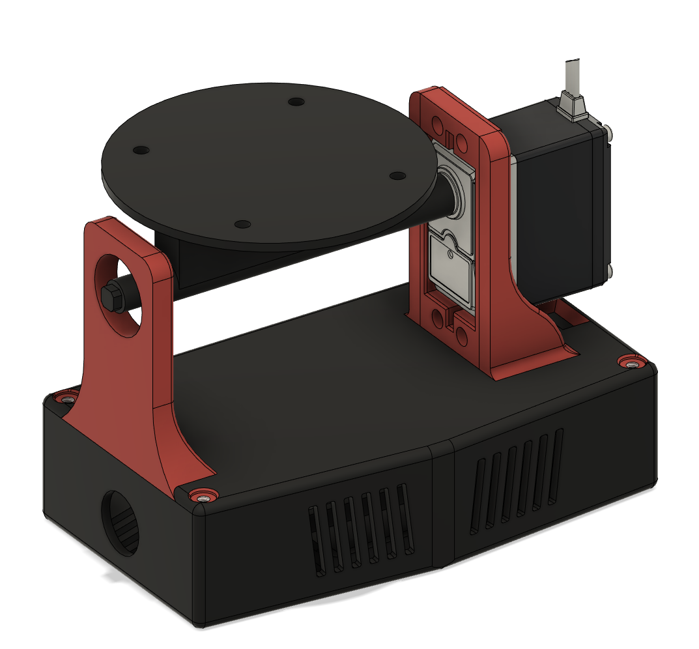

# 3D LiDAR Scanner
This repo contains the source code and CAD files to create a 3D printed three-dimensional environment scanner using ROS. The software carries out a set number of scans per degree of a set rotation range. It takes an average of these scans and then publishes a pointcloud2.


## BOM
| Item                                                                                   | Quantity | Price                |
|----------------------------------------------------------------------------------------|----------|----------------------|
| RPLidar A2 (Can use a different LiDAR, but the LiDAR platform will need to be adapted) | 1        | £280                 |
| Digital Servo 270                                                                      | 1        | £19.99               |
| Arduino Nano Every                                                                     | 1        | £11                  |
| 698 Bearing                                                                            | 1        | £4.55 (pack of 10)   |
| M4 12mm hex bolt                                                                       | 4        | £2.28 (pack of 10)   |
| M4 hex nut                                                                             | 4        | £1.89 (pack of 5)    |
| M3 12mm hex bolt                                                                       | 5        | £2.28 (pack of 10)   |
| M3 8mm hex bolt                                                                        | 2        | £2.28 (pack of 10)   |
| 9.54mm (internal) rubber grommet                                                       | 2        | 9.79 (assorted pack) |

**Total cost:** £334.06

## Installation and first-time use
1. Clone the repository into your catkin workspace `src` folder.

    ```bash
    git clone https://gitlab.com/andrew_t97/3d-lidar-scanner.git
    ```

2. Run `catkin_make`. Make sure you're building for Python 2.7; otherwise, you're likely to get an issue with the transforms package.
3. Launch the package with the LiDAR and Arduino connected to your PC. This will begin the scan and launch rviz, which should display the current progress of the scan.
   ```bash
   roslaunch three_dimensional_lidar_scanner scan_and_view.launch
   ```
   Once the scan has completed, you should get something like this:

   


## Parameters
- `number_of_scans_to_average` (`int`, default: 5) \
&nbsp;&nbsp;&nbsp;&nbsp;The number of scans collected at each degree the LiDAR is rotated. A higher value provides a more accurate scan at the cost of the increased overall runtime
- `minimum_scan_angle` (`int`, default: 45) \
&nbsp;&nbsp;&nbsp;&nbsp;The minimum rotational degree of the servo rotating the LiDAR. The absolute minimum as set by the Arduino code is 0 degrees.
- `maximum_scan_angle` (`int`, default: 225) \
&nbsp;&nbsp;&nbsp;&nbsp;The maximum rotational degree of the servo rotating the LiDAR. The absolute maximum as set by the Arduino code is 270 degrees.
- `base_frame` (`string`, default: axle) \
&nbsp;&nbsp;&nbsp;&nbsp; The frame ID for the transform of the axle the LiDAR is rotating about
- `laser_topic` (`string`, default: scan) \
&nbsp;&nbsp;&nbsp;&nbsp; The topic ID to subscribe to for scans from the LiDAR.
- `laser_pointcloud` (`string`, default: laser_pointcloud) \
&nbsp;&nbsp;&nbsp;&nbsp; The topic ID to publish the 3D pointcloud to.

## Subscribed topics
- `scan` (sensor_msgs/LaserScan) \
&nbsp;&nbsp;&nbsp;&nbsp;Subscribes to the scans published by the LiDAR,
## Published topics
- `laser_pointcloud` (sensor_msgs/PointCloud2) \
&nbsp;&nbsp;&nbsp;&nbsp;Publishes the three-dimensional pointcloud after each scan.

## CAD
During the design process, I worked through multiple versions. I've uploaded the latest ones to this repo as 3MFs. The following is the final design assembled in Fusion 360:

